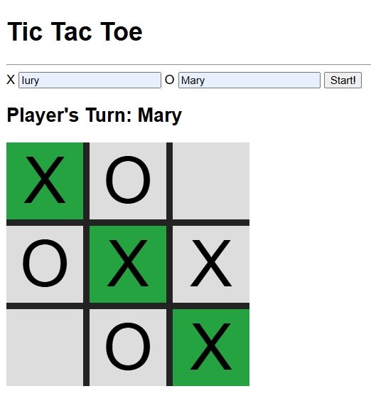

# 🧠 Tic Tac Toe - Projeto Simples com JavaScript

Este é um projeto básico de **Jogo da Velha (Tic Tac Toe)** desenvolvido com **HTML**, **CSS** e **JavaScript puro** com o objetivo de praticar conceitos iniciais de manipulação do DOM, eventos e lógica condicional no JavaScript.

## 🎯 Objetivo

Criar um jogo de dois jogadores onde:

- Os jogadores inserem seus nomes.
- Alternam jogadas entre "X" e "O".
- O jogo identifica automaticamente o vencedor.
- O tabuleiro reinicia com o botão "Start!".

## 💡 Funcionalidades

- Interface simples com inputs para nomes dos jogadores.
- Tabuleiro interativo usando `grid` CSS.
- Alternância de turnos exibida em tempo real.
- Verificação automática de vitória nas linhas, colunas e diagonais.
- Destaque visual para a linha vencedora.

## 🛠️ Tecnologias Utilizadas

- **HTML5** para a estrutura da página.
- **CSS3** simples para estilização do tabuleiro e layout.
- **JavaScript** puro para lógica do jogo e interação com o DOM.

## 📸 Preview

📚 Aprendizados
--
Durante o desenvolvimento, foram praticados conceitos como:

- Manipulação do DOM com querySelector e dataset.
- Eventos de clique com addEventListener.
- Condicionais e lógica para verificação de vitória.
- Organização de código em arquivos separados.

📌 Observações

- O projeto é apenas para fins educacionais e prática de lógica com JavaScript básico.
- O CSS é propositalmente simples, focando na funcionalidade.
